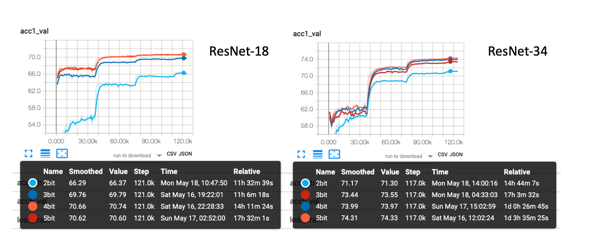

## ImageNet

`models.quant_layer.py` contains the configuration for quantization. In particular, you can specify them in the class `QuantConv2d`:

```python
class QuantConv2d(nn.Conv2d):
    """Generates quantized convolutional layers.

    args:
        bit(int): bitwidth for the quantization,
        power(bool): (A)PoT or Uniform quantization
        additive(float): Use additive or vanilla PoT quantization

    procedure:
        1. determine if the bitwidth is illegal
        2. if using PoT quantization, then build projection set. (For 2-bit weights quantization, PoT = Uniform)
        3. generate the clipping thresholds

    forward:
        1. if bit = 32(full precision), call normal convolution
        2. if not, first normalize the weights and then quantize the weights and activations
    """

    def __init__(self, in_channels, out_channels, kernel_size, stride=1, padding=0, dilation=1, groups=1, bias=False, bit=5, power=True, additive=True):
        super(QuantConv2d, self).__init__(in_channels, out_channels, kernel_size, stride, padding, dilation, groups, bias)
        self.layer_type = 'QuantConv2d'
        assert bit == 32 or (bit >= 2 and bit <= 8), 'Bitwidth Not Supported!'
        self.bit = bit
        if self.bit != 32:
            self.power = power
            if power:
                if self.bit > 2:
                    self.proj_set_weight = build_power_value(B=self.bit-1, additive=additive)
                self.proj_set_act = build_power_value(B=self.bit, additive=additive)
            self.act_alpha = torch.nn.Parameter(torch.tensor(6.0))
            self.weight_alpha = torch.nn.Parameter(torch.tensor(3.0))
```

Here, `self.bit`  controls the bitwidth;  `power=True` means we use PoT or APoT (use `additive` to specify). `build_power_value` construct the levels set Q^a(1, b) with parameter `bit` and `additive`. If `power=False`, the conv layer will adopt uniform quantization. 

To train a 5-bit model, just run main.py:

```bash
python main.py -a resnet18 --bit 5
```

Progressive initialization requires checkpoint of higher bitwidth. For example

```bash
python main.py -a resnet18 --bit 4 --pretrained checkpoint/res18_5best.pth.tar
```

We provide a function `show_params()` to print the clipping parameter in both weights and activations

###Hyper-params

Models are initialized with pre-trained models, please use `pretrained=True` to intialize the model. We use the following hyper-params for all parameters, including the clipping thresholds.

Learning rate is scaled by 0.1 at epoch 30,60,90.

### Results and Checkpoints

Checkpoints are released in [Google Drive](https://drive.google.com/open?id=1iIZ1tsaFLSuaujPbnyLutxDZuG31i5kD).

|   Model   | Precision | Hyper-Params                      | Accuracy | Checkpoints                                                  |
| :-------: | --------- | --------------------------------- | -------- | ------------------------------------------------------------ |
| ResNet-18 | 5-bit     | batch1k_lr0.01_wd0.0001_100epoch  | 70.75    | [res18_5bit](https://drive.google.com/open?id=1AuXWyBwt8yi1ocrsp4laVUwXI7W52S6G) |
| ResNet-18 | 4-bit     | batch1k_lr0.01_wd0.0001_100epoch  | 70.74    | [res18_4bit](https://drive.google.com/open?id=1rpHbbjmA539xndpg-2QIludSvWDNrMGP) |
| ResNet-18 | 3-bit     | batch1k_lr0.01_wd0.0001_100epoch  | 69.79    | [res18_3bit](https://drive.google.com/open?id=1zJX3tbAbBXYxpP8QYx3dvMQoiGrCO9dc) |
| ResNet-18 | 2-bit     | batch1k_lr0.01_wd0.00002_100epoch | -        | Updating                                                     |
| ResNet-34 | 5-bit     | batch1k_lr0.1_wd0.0001_100epoch   | 74.26    | [res34_5bit](https://drive.google.com/open?id=1tXIV03PNu8QpSF2fhrR3werhBB34Sb42) |
| ResNet-34 | 4-bit     | batch1k_lr0.1_wd0.0001_100epoch   | -        | Updating                                                     |

### Compared with Uniform Quantization

To be updated

### Training and Validation Curve

To be updated

```bash
cd $PATH-TO-THIS-PROJECT/ImageNet/events
tensorboard --logdir 'res18' --port 6006
```



###Hyper-parameteres Exploration

To be updated

